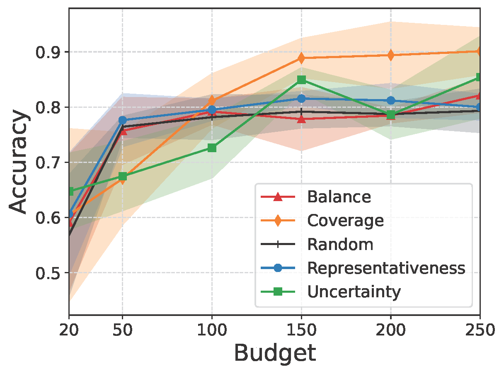

# HOCOBIS-AL
This repository contains the code and supplementary material for our paper "***H***ow To ***O***vercome **CO**nfirmation ***B***ias ***I***n ***S***emi-Supervised Image Classification By ***A***ctive ***L***earning" (ECML PKDD 2023)

We investigate the applicability of AL baselines in combination with SSL techniques. 
We identify 3 typical real-world challenges in image classification (Between-Class-Imbalance (BCI), Between-Class-Similarity (BCS) and Within-Class-Imbalance (WCI)) and demonstrate how SSL performance deteriorates when the labeled pool consists only of randomly chosen data due to confirmation bias. 
In addition, we demonstrate how simple active learning methods can overcome confirmation bias in SSL and significantly outperform results compared to passive selection in such challenging real-world scenarios.


| t-SNE Between-Class-Imbalance (BCI)                                                                                                                                                                          | t-SNE Between-Class-Similarity (BCS)                                                                                                                                                         | t-SNE Within-Class-Imbalance (WCI)                                                                                                                                                                                                                  |
|--------------------------------------------------------------------------------------------------------------------------------------------------------------------------------------------------------------|----------------------------------------------------------------------------------------------------------------------------------------------------------------------------------------------|-----------------------------------------------------------------------------------------------------------------------------------------------------------------------------------------------------------------------------------------------------|
|                                                                                                                                                                                         |                                                                                                                                                                         |                                                                                                                                                                                                                                |
| Random Sampling BCI                                                                                                                                                                                          | Random Sampling BCS                                                                                                                                                                          | Random Sampling WCI                                                                                                                                                                                                                                 |
|                                                                                                                                                                                 |                                                                                                                                                                 |                                                                                                                                                                                                                        |
| Confirmation Bias BCI                                                                                                                                                                                        | Confirmation Bias BCS                                                                                                                                                                        | Confirmation Bias WCI                                                                                                                                                                                                                               |
| Entropy of PL for original MNIST (orange) vs. entropy of PL for BCI-MNIST (blue). Confirming class imbalance by incorporating imbalanced pseudo-labels over and over. <br/> | Amount of wrong PL for original MNIST (orange) vs BCS-MNIST (blue). Confirming wrong predictions by incorporating wrong pseudo-labels over and over. <br/>  | Even though correctness of PL in WCI-MNIST (blue line) is better than in original MNIST (orange line), the final accuracy is worse (markers) since only the same, easy concepts are confirmed over and over.<br/>  |
| Pseudo-Labeling: <br/>                                                                                                                                                  | Pseudo-Labeling: <br/>                                                                                                                                  | Pseudo-Labeling: <br/>                                                                                                                                                                                         |
| Flexmatch: <br/>                                                                                                                                                          | Flexmatch: <br/>                                                                                                                                          | Flexmatch: <br/>                                                                                                                                                                                                 |
| Fixmatch: <br/>                                                                                                                                                            | Fixmatch: <br/>                                                                                                                                            | Fixmatch: <br/>                                                                                                                                                                                                   |
# Getting started

## Install Requirements
```
python3 -m venv venv
source venv/bin/activate
pip install -U pip
pip install -r requirements.txt
```

## Start MLFlow for Tracking
```
(venv) mlflow server --tracking_uri=${TRACKING_URI}
```

## Run Experiments
Start the experiment using the script ```executables/main.py```:

```
(venv) PYTHONPATH=. python executables/main.py --tracking_uri=${TRACKING_URI}
```

